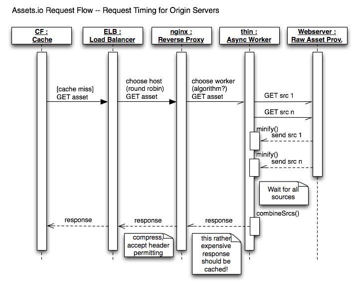

!SLIDE assetsio_1 light-on-dark

!SLIDE bullets
# The birth of Assets.io
## Idea for a service that would...
* minify and package automatically
* provide easy cache busting
* send long expires headers
* offer gzip compression
* deliver through Content Delivery Network

!SLIDE smaller light-on-dark dr-evil

!SLIDE light-on-dark
# Conclave in my rural office

!SLIDE
# We came back with this cunning plan

!SLIDE subsection
# Let's start the tour in the browser

!SLIDE
# How to integrate
## a typical website head
    @@@ html
    <head>
      <title>My website</title>

      <!-- Stylesheets -->
      <link rel="stylesheet" href="/css/base.css">
      <link rel="stylesheet" href="/css/navigation.css">

      <!-- Javascript -->
      
      
      
    </head>

!SLIDE incremental
# How to integrate
## rewritten to use Assets.io
    @@@ html
    <head>
      <title>My website</title>

      

      
    </head>
* dynamic insertion of tags via loader API
* packages defined *within* source code

!SLIDE incremental
# Here's what gets loaded
    http://your-account-id.cloudfront.net/eyJyIjoiYjYiLCJhIjoieW91 \
          ci1hY2NvdW50LWlkIiwiaCI6IiIsInMiOlsiaHR0cDovL2V4YW1wbGUu \
          b3JnL2Nzcy9iYXNlLmNzcyIsImh0dHA6Ly9leGFtcGxlLm9yZy9jc3Mv \
          bmF2aWdhdGlvbi5jc3MiXX0=.css

    http://your-account-id.cloudfront.net/eyJyIjoiYjYiLCJhIjoieW91 \
          ci1hY2NvdW50LWlkIiwiaCI6IiIsInMiOlsiaHR0cDovL2V4YW1wbGUu \
          b3JnL2pzL2pxdWVyeS5qcyIsImh0dHA6Ly9leGFtcGxlLm9yZy9qcy9w \
          bHVnaW4uanMiLCJodHRwOi8vZXhhbXBsZS5vcmcvanMvc2l0ZS5qcyJd \
          fQ==.js
* request to Amazon's CloudFront CDN
* the gibberish is Base64 encoded JSON

!SLIDE center
# JSON asset request
    @@@ javascript
    {
      "r": "b6",               // API release
      "a": "your-account-id",  // CF distribution
      "s": [                   // FQDN sources
        "http://example.org/css/base.css",
        "http://example.org/css/navigation.css"
      ]
    }
* note: CloudFront ignores any URL query strings
* thus this information had be encoded into the path!
* it is the operating instruction for the backend

JSON offers very good flexibility and future extensibility

!SLIDE
# What about cache busting?
## assign a version globally (think: Git SHA)
    assets.version('6091d765');

## or per asset package
    assets.js('/js/whatever.js', {version: 1});

* changing the version immediately busts the cache

!SLIDE incremental
# Next challenge: Fallback
    As a user of Assets.io
    When anything goes wrong on their end
    I still want to have a working website

* the JS API needs to check if the assets arrived
  - timeout!
* if not, issue individual requests for each part
  - slower, but no broken site

!SLIDE
# BTW, Jasmine specs written in CoffeeScript are a thing of beauty!
    @@@ javascript
    describe 'API', ->
      it 'should define the global assets object', ->
        expect(window.assets).toBeDefined()

      describe 'changing default settings', ->
        beforeEach ->
          @defaultSettings = {}
          for own setting, value of assets.settings
            @defaultSettings[setting] = value

        afterEach ->
          assets.settings = @defaultSettings

        describe '#account', ->
          it 'should set the account', ->
            assets.account('an-account')
            expect(assets.settings.account).toEqual 'an-account'
* (that had to be said)

!SLIDE subsection
# In da Cloud

<!-- TODO: maybe we can describe the hosting setup here... -->
!SLIDE
# Amazon Web Services
* Cloudfront
* EC2
* ELB
* Auto-Scaling Groups FTW

!SLIDE subsection
# Teh Backend: Ruby time

!SLIDE request-flow bullets
# Request Flow & Timing

!SLIDE
# Two sides for maximizing throughput
* Take on new requests while waiting for the assets
* Parallelize fetching from customer's server

!SLIDE bullets
# Evented Web App servers
* Good old Thin
  - already uses EventMachine reactor loop
* Alternate approaches
  - Goliath (uses Ruby 1.9 fibers)
    <https://github.com/postrank-labs/goliath>
  - Rainbows (supports multiple concurrency models)
    <http://rainbows.rubyforge.org/>

!SLIDE
# Async Response
## throw :async
    @@@ ruby
    def call(env)
      request = RequestParser.new(env).request

      Response.new(request, env['async.callback']).process
      throw :async
    end

## Alternate approaches
* dummy Rack response: `[-1, {}, []]`
* thin_async wrapper <https://github.com/macournoyer/thin_async>

!SLIDE
# Parallel asset fetching
## em-http-request
    @@@ ruby
    multi = EM::MultiRequest.new

    # add multiple requests to the multi-handler
    multi.add(:a, EM::HttpRequest.new('http://www.google.com/').get)
    multi.add(:b, EM::HttpRequest.new('http://www.yahoo.com/').get)

    multi.callback {
      # all requests have completed at this point
    }

* Alternate approach: em-synchrony (using Ruby 1.9 fibers)
  <https://github.com/igrigorik/em-synchrony>

!SLIDE bullets
# Processing
* Minification
  - JS: Uglifier
  - CSS: Rainpress
* Url rewriting (CSS)
* Wrapping

!SLIDE bullets
# What's next?
* Work in progress
  - Integration into Rails 3.1 asset pipeline
    <https://github.com/assets-io/assetsio-rails>
* Closed Beta from July 4, 2011
* Coming soon
  - Image optimization & CSS sprites
