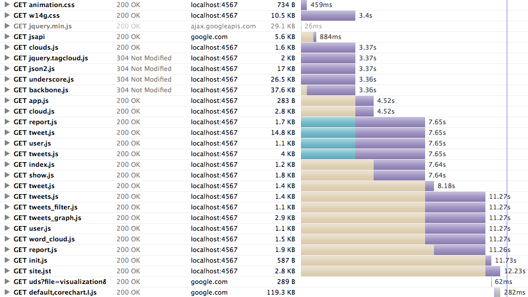

!SLIDE subsection center
# W14g

!SLIDE incremental
# So what is W14g?
* Webapp built on top of the Twitter API
* Data visualization experiment
* Learning project
* 100% Buzzword compliant

!SLIDE incremental
# JavaScript *App*
* Based on *Backbone.js* (Single page JS App)
* Written entirely in *Coffeescript*
* *HTML5* / *CSS3* Animations

!SLIDE subsection center
# Demo
<http://www.w14g.com>

Do a fun demo. Show a few nice selections. Tweet along.

!SLIDE light-on-dark
# Figured: This could go viral!

!SLIDE incremental
# What if I built it and they come?
## ZOMG PERFORMANCE MATTERS
* Need a hosting solution that scales
* Content Delivery network for a global audience (CF)
* Optimized page load

!SLIDE
# Lots of sources

Been my first actual JS app, not just some behavior sprinkled on top of views.
Had to think about structuring the code.

!SLIDE bullets incremental
# Aside: Web Performance 101
* Fewer requests through packaging (concatenation)
* Save requests completely by proper caching
  - it's in the headers
* Smaller assets save bandwidth
  - minification and gzip compression
* Fast delivery via CDN

!SLIDE incremental
# Solving the asset problem, take one
* Middleman <https://github.com/tdreyno/middleman>
* Jammit <http://documentcloud.github.com/jammit/>
* Custom development and build environments
* Manual asset management + cache invalidation

* How many of you have used asset packaging solutions with their Rails
  projects?

!SLIDE light-on-dark effort
# Feels like...

### <http://www.flickr.com/photos/unices/4022007384/>

Works nice, but was a lot of effort to get to this point.

Asset management is still hard, so hard that you usually don't do it unless
you absolutely have to. Rails' asset pipeline will be a game changer, though

